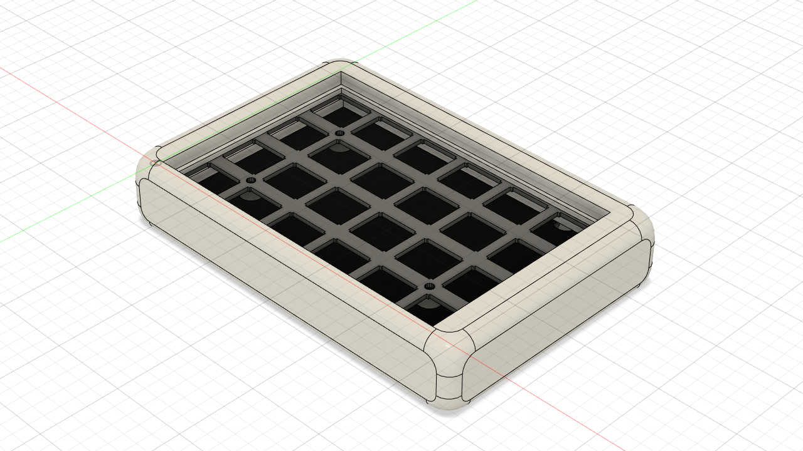

# High Profile Gasket Mount Case for the Let's Split keyboard

**IMPORTANT: This design has NOT been tested yet, so print at your own risk.**

This case was designed for [QMK's plate](https://github.com/qmk/qmk.fm/blob/gh-pages/keyboards/lets_split/plate.stl) and [Wootpatoot](https://www.reddit.com/user/wootpatoot/)'s PCB (the one featured in [this assembly guide](https://github.com/nicinabox/lets-split-guide/blob/master/assembly.md)).

It has a wall thickness of 3mm.

It is currently WIP.
